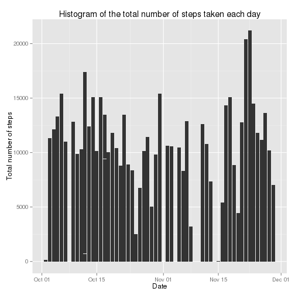
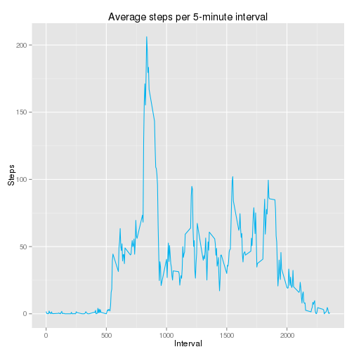
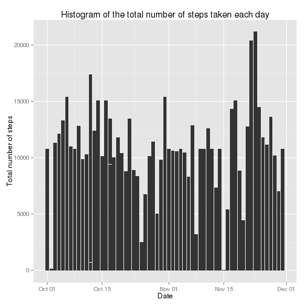
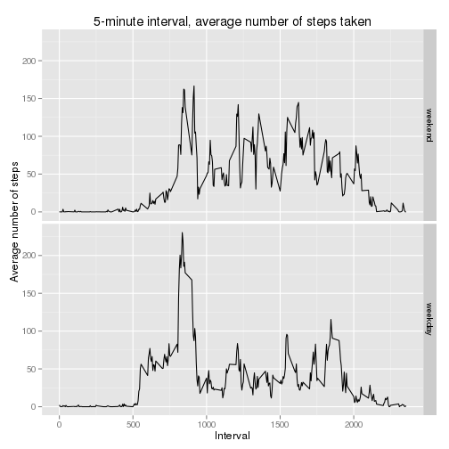

# Reproducible Research: Peer Assessment 1


## Loading and preprocessing the data

The following packages are used to produce this report:


```r
library(ggplot2)
library(knitr)
library(scales)
```


Read the dataset:


```r
activity <- read.csv(unz("activity.zip", filename = "activity.csv"), sep = ",", 
    header = T)
activity$date <- as.Date(activity$date)
```


## What is mean total number of steps taken per day?
Question 1: Make a histogram of the total number of steps taken each day
The following code can be used to generate the histogram:

```r
ggplot(activity, aes(x = date, y = steps)) + geom_histogram(stat = "identity") + 
    labs(title = "Histogram of the total number of steps taken each day", x = "Date", 
        y = "Total number of steps")
```

```
## Warning: Removed 2304 rows containing missing values (position_stack).
```

 


Question 2: Calculate and report the *mean* and *median* total number of steps taken per day

The following code can be used to calculate the mean and median:


```r
activityWithoutNA <- na.omit(activity)
totalStepsPerDay <- aggregate(activityWithoutNA$steps, list(activityWithoutNA$date), 
    sum)$x

mean(totalStepsPerDay)
```

```
## [1] 10766
```

```r
median(totalStepsPerDay)
```

```
## [1] 10765
```


## What is the average daily activity pattern?
Question 1: Make a time series plot (i.e. type = "l") of the 5-minute interval (x-axis) and the average number of steps taken, averaged across all days (y-axis)

```r
meanStepsPerInterval <- aggregate(list(Steps = activity$steps), by = list(Interval = activity$interval), 
    FUN = mean, na.rm = TRUE)

ggplot(meanStepsPerInterval, aes(x = Interval, y = Steps)) + geom_line(color = "deepskyblue2") + 
    ggtitle("Average steps per 5-minute interval")
```

 


Question 2: Which 5-minute interval, on average across all the days in the dataset, contains the maximum number of steps?


```r
maxMeanPerInterval <- max(meanStepsPerInterval$Steps)
subset(meanStepsPerInterval, Steps == maxMeanPerInterval)$Interval
```

```
## [1] 835
```


## Imputing missing values
Question 1: Calculate and report the total number of missing values in the dataset (i.e. the total number of rows with NAs)


```r
sum(is.na(activity))
```

```
## [1] 2304
```


Question 2: Devise a strategy for filling in all of the missing values in the dataset. The strategy does not need to be sophisticated. For example, you could use the mean/median for that day, or the mean for that 5-minute interval, etc.

The **mean** of steps taken 
Replacing the missing data with the **mean** seems most appropriate.

Question 3: Create a new dataset that is equal to the original dataset but with the missing data filled in.

```r
meanWithoutNA <- function(x) {
    mean(x, na.rm = TRUE)
}

mergedIntervalMeans <- merge(activity, meanStepsPerInterval, by.x = "interval", 
    by.y = "Interval")

rowsWithNA = is.na(mergedIntervalMeans$steps)

mergedIntervalMeans[rowsWithNA, "steps"] <- mergedIntervalMeans[rowsWithNA, 
    "Steps"]

activityNew <- mergedIntervalMeans[, c("steps", "date", "interval")]
```


Question 4: Make a histogram of the total number of steps taken each day and Calculate and report the mean and median total number of steps taken per day. Do these values differ from the estimates from the first part of the assignment? What is the impact of imputing missing data on the estimates of the total daily number of steps?


```r
ggplot(activityNew, aes(x = date, y = steps)) + geom_histogram(stat = "identity") + 
    labs(title = "Histogram of the total number of steps taken each day", x = "Date", 
        y = "Total number of steps")
```

 


## Are there differences in activity patterns between weekdays and weekends?

Question 1: Create a new factor variable in the dataset with two levels – “weekday” and “weekend” indicating whether a given date is a weekday or weekend day.


```r
activityWeekday <- weekdays(activityNew$date)
activityWeekend <- activityWeekday == "Sunday" | activityWeekday == "Saturday"
activityNew$weekday <- factor(activityWeekend, levels = c(FALSE, TRUE), labels = c("weekday", 
    "weekend"))
```

Question 2: Make a panel plot containing a time series plot (i.e. type = "l") of the 5-minute interval (x-axis) and the average number of steps taken, averaged across all weekday days or weekend days (y-axis). 


```r
averageStepsPerDay <- aggregate(activityNew$steps, list(Interval = as.numeric(as.character(activityNew$interval)), 
    Weekday = activityNew$weekday), mean)

ggplot(averageStepsPerDay, aes(x = Interval, y = x)) + geom_line() + facet_grid(Weekday ~ 
    ., , as.table = FALSE) + labs(title = "5-minute interval, average number of steps taken", 
    x = "Interval", y = "Average number of steps")
```

 


